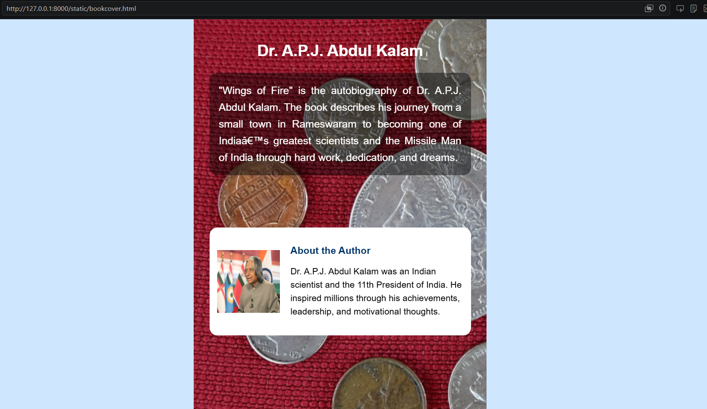

# Ex.05 Book Front Cover Page Design
# Date:25.05.2026
# AIM:
To design a book front cover page using HTML and CSS.

# DESIGN STEPS:
## Step 1:
Create a Django Admin project.

## Step 2:
Create an app in the Django interface.

## Step 3:
Create a folder named 'static' in the app folder.

## Step 4:
Create a new HTML file in the static folder.

## Step 5:
Write the HTML code with relevant CSS properties.

## Step 6:
Choose the appropriate style and color scheme.

## Step 7:
Insert the images in their appropriate places.

## Step 8:
Publish the website in the LocalHost.

# PROGRAM:

<!DOCTYPE html>
<html>
<head>
<title>Wings of Fire</title>

</head>

<body>

<h1>WINGS OF FIRE</h1>
<h2>Dr. A.P.J. Abdul Kalam</h2>

"Wings of Fire" is the autobiography of Dr. A.P.J. Abdul Kalam. 
The book describes his journey from a small town in Rameswaram 
to becoming one of India’s greatest scientists and the Missile Man 
of India through hard work, dedication, and dreams.

<h3>About the Author</h3>

Dr. A.P.J. Abdul Kalam was an Indian scientist and the 11th President of India. 
He inspired millions through his achievements, leadership, and motivational thoughts.

Inspire India Publications

₹599

</body>
</html>

# OUTPUT:

# RESULT:
The program for designing book front cover page using HTML and CSS is completed successfully.
